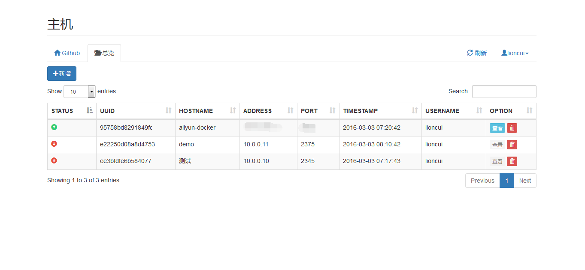
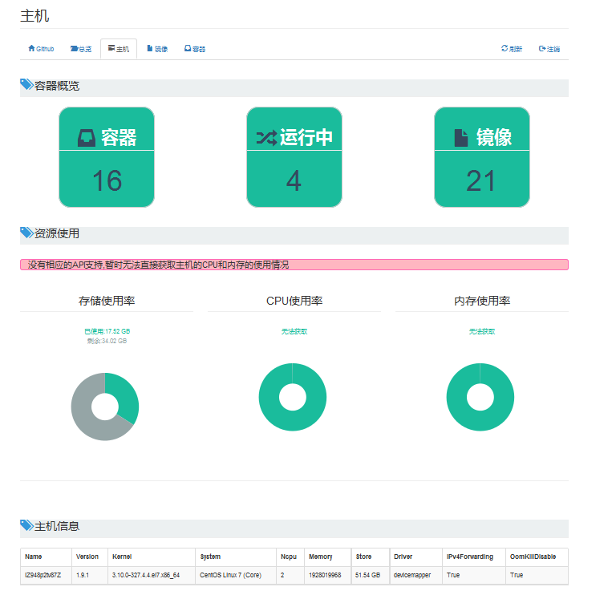
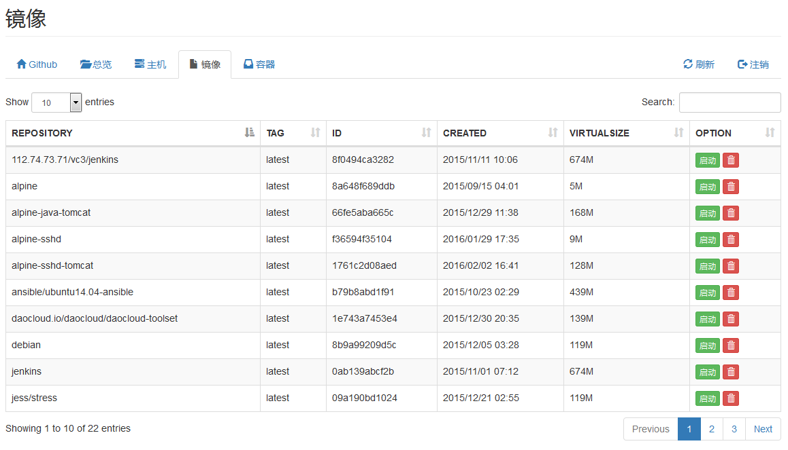
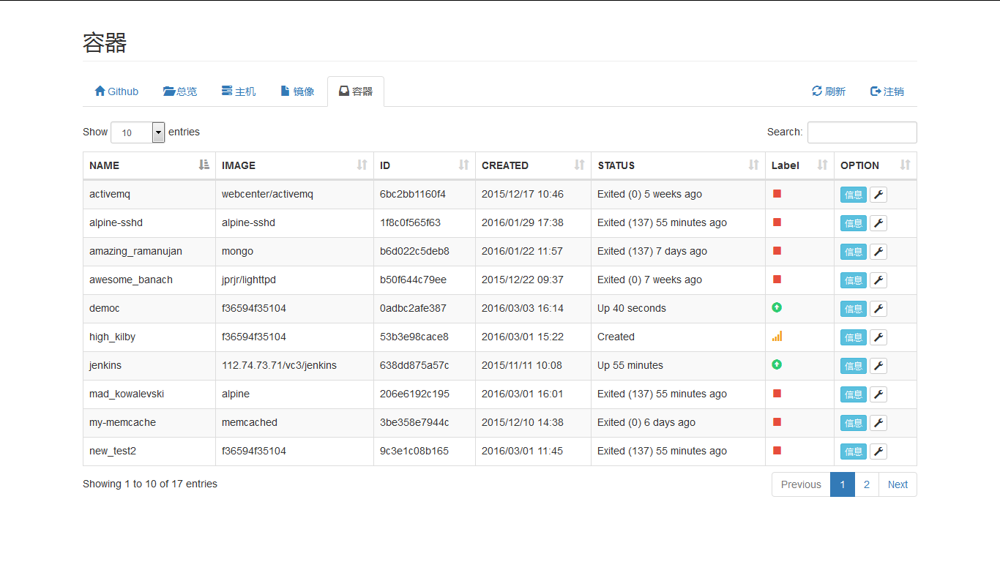

#DockMaster

作者:Lioncui

##关于我
>本项目完全出去兴趣使然而做的,之前粗略地写了dockerweb -> http://github.com/lioncui/dockerweb
>后来应几个朋友要求,重写了一次,优化了代码结构,增加了多主机管理,并且把前端页面效果丰富了一下.
>本人为非专业开发人员,爱好编码,做这个项目主要是为了练手,独立完成设计与开发.
>在使用中有遇到BUG或者希望实现某功能的,可以在issues中提出来.

##关于项目
>整个项目基于python2.7语言, flask web框架, bootstrap前端框架
>依赖模块 flask, flask-sqlalchemy, pymysql, dockerpy
>在config.py里面指定数据库连接`mysql+pymysql://username:password@ip:port/dbname`
>创建数据库表 python create_db.py 即可,数据库对应会生成user表和engine表
>运行

##特别感谢
>感谢同事老谭的支持,教会了我一些简单的jquery使用

##使用截图

